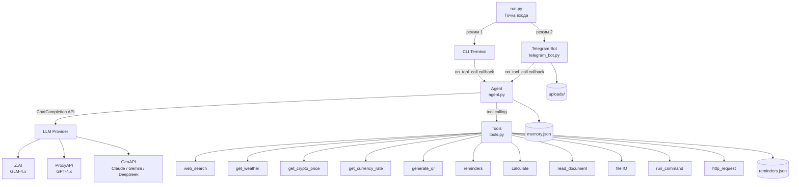
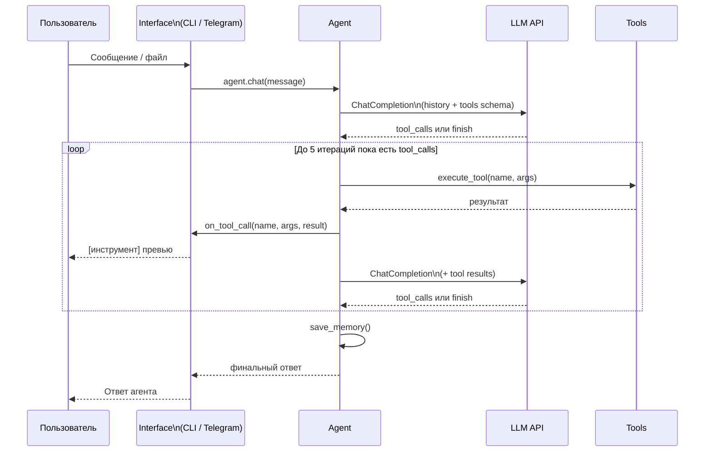
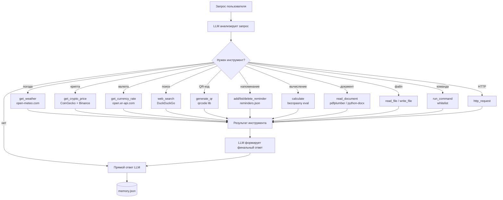
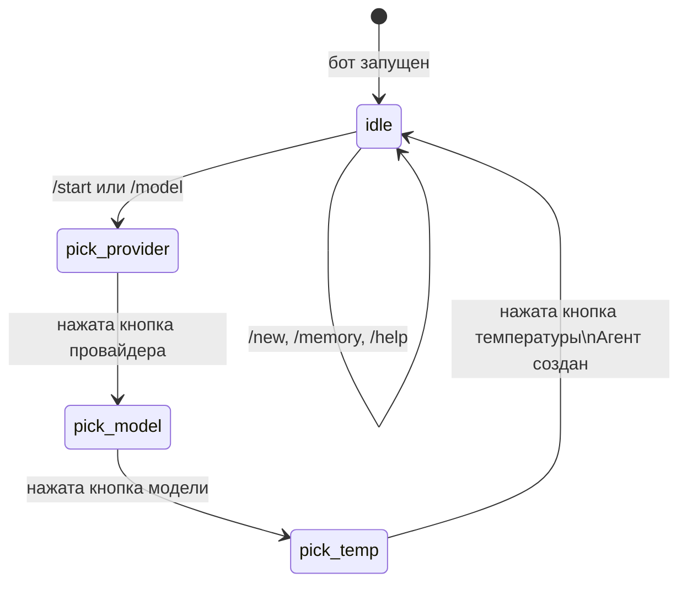

# Local AI Agent

Терминальный и Telegram AI-агент с поддержкой инструментов. Подключается к любому OpenAI-совместимому провайдеру, понимает задачи на естественном языке и сам выбирает нужный инструмент для выполнения.

---

## Требования к версии Python

Проект требует **Python < 3.12** для совместимости с LangChain 0.7.3.
При запуске на Python 3.12+ скрипт завершится с ошибкой и подскажет что делать.

На Windows используется `py` launcher:
```bat
py -3.11 -m venv venv311
venv311\Scripts\activate
```

На Linux / macOS:
```bash
python3.11 -m venv venv311
source venv311/bin/activate
```

---

## Быстрый старт

```bat
cd agent
py -3.11 -m venv venv311
venv311\Scripts\activate
pip install -r requirements.txt
```

Запуск на Windows:
```bat
.\run.bat
```

Запуск на Linux / macOS:
```bash
python run.py
```

При запуске выбирается режим:
```
  1. Терминал (CLI)
  2. Telegram бот
```

---

## Структура проекта

```
agent/
├── run.py            # Точка входа: выбор режима CLI / Telegram
├── run.bat           # Запуск на Windows (устанавливает UTF-8 кодировку)
├── agent.py          # Класс Agent, провайдеры, OpenAI tool calling
├── tools.py          # Все инструменты агента
├── telegram_bot.py   # Telegram-интерфейс (pyTelegramBotAPI)
├── memory.json       # История диалогов (автоматически, до 100 записей)
├── reminders.json    # Напоминания (автоматически)
├── uploads/          # Загруженные через Telegram файлы
├── requirements.txt  # Зависимости Python
├── .env              # API-ключи (не коммитить в git)
└── README.md         # Документация
```

---

## Настройка (.env)

```env
BOT_TOKEN=...         # Telegram Bot Token (от @BotFather)
ZAI_API_KEY=...       # Z.AI — бесплатные модели GLM
PROXY_API_KEY=...     # ProxyAPI — GPT-4o, GPT-4.1
GEN_API_KEY=...       # GenAPI — GPT, Claude, Gemini, DeepSeek
```

---

## Архитектура



---

## Поток обработки сообщения



---

## Логика выбора инструмента



---

## Провайдеры и модели

| # | Провайдер | Переменная | Модели |
|---|-----------|------------|--------|
| 1 | Z.AI | `ZAI_API_KEY` | GLM-4.7-Flash (бесплатно), GLM-4.5-Flash (бесплатно), GLM-4.7, GLM-4.5 |
| 2 | ProxyAPI | `PROXY_API_KEY` | GPT-4.1 Nano, GPT-4.1 Mini, GPT-4o Mini, GPT-4o |
| 3 | GenAPI | `GEN_API_KEY` | GPT-4.1 Mini, GPT-4o, Claude Sonnet 4.5, Gemini 2.5 Flash, DeepSeek Chat |

---

## Режим CLI

### Команды в диалоге

| Команда | Действие |
|---------|----------|
| `/new` | Очистить историю диалога (системный промпт сохраняется) |
| `/memory` | Показать последние 5 записей из памяти |
| `/model` | Сменить провайдера, модель, температуру |
| `/load <путь>` | Загрузить документ (pdf / docx / txt) в контекст |
| `/docs` | Список загруженных документов |
| `/help` | Список команд |
| `/exit` | Выйти |

### Примеры

```
Вы: Какая погода в Токио?
Вы: Сколько стоит Ethereum в рублях?
Вы: Какой курс доллара к рублю?
Вы: Создай QR-код для https://github.com
Вы: Напомни купить продукты 2026-04-01 18:00
Вы: Вычисли factorial(20) / 2**10
Вы: /load C:\docs\contract.pdf
Вы: Какие условия расторжения договора?
```

---

## Режим Telegram

### Команды бота

| Команда | Действие |
|---------|----------|
| `/start` | Выбрать провайдера и модель (inline-кнопки) |
| `/model` | Сменить провайдера / модель |
| `/new` | Очистить историю диалога |
| `/memory` | Последние записи из памяти |
| `/help` | Список команд |

### Жизненный цикл сессии



### Загрузка документов в Telegram

1. Отправьте файл (pdf / docx / doc / txt) боту
2. Бот скачает файл в `uploads/`, извлечёт текст и вставит его в историю диалога
3. Задавайте вопросы по содержимому — агент отвечает напрямую из контекста
4. Можно добавить подпись к файлу — агент сразу ответит на этот вопрос

Поддерживаемые форматы: `.pdf`, `.docx`, `.doc`, `.txt`
Лимит контекста: первые 6000 символов документа передаются в историю.

---

## Инструменты агента

### web_search
Поиск в интернете через DuckDuckGo (пакет `ddgs`).
```
Найди последние новости про Python 3.13
Что такое квантовые вычисления?
```

### get_weather
Текущая погода по городу. Геокодинг через Open-Meteo, данные через open-meteo.com. Без ключей.
```
Какая погода в Лондоне?
Температура в Токио сейчас
```

### get_crypto_price
Курс криптовалюты. Основной источник: CoinGecko (retry при 429). Fallback: Binance API.
```
Сколько стоит Bitcoin в рублях?
Курс Ethereum в USD
```
Поддерживаемые монеты: `bitcoin`, `ethereum`, `solana`, `ripple`, `dogecoin`, `litecoin`, `cardano` и тысячи других.

### get_currency_rate
Курс обычных валют через open.er-api.com (без ключей, поддерживает RUB).
```
Какой курс доллара к рублю?
Курс EUR/USD
Сколько стоит юань в рублях?
```
Поддерживаемые валюты: `USD`, `EUR`, `RUB`, `GBP`, `JPY`, `CNY`, `CHF`, `CAD`, `AUD` и другие.

### generate_qr
Генерация QR-кода в PNG файл через библиотеку `qrcode[pil]`.
```
Создай QR-код для https://example.com
Сгенерируй QR с текстом "Привет" и сохрани в my.png
```

### Напоминания (add_reminder / list_reminders / delete_reminder)
Хранение в `reminders.json`. Поддержка просроченных задач.
```
Напомни позвонить врачу 2026-04-01 10:00
Добавь задачу "Сдать отчёт" на 2026-03-30
Покажи мои напоминания
Отметь напоминание #2 выполненным
```
Формат даты: `YYYY-MM-DD HH:MM` или `YYYY-MM-DD`.

### calculate
Безопасный вычислитель математических выражений.

| Функция | Описание |
|---------|----------|
| `sqrt(x)` | Квадратный корень |
| `pow(x, y)` / `x**y` | Степень |
| `log(x)` / `log(x, base)` | Логарифм |
| `log2(x)`, `log10(x)` | Логарифм по основанию 2 / 10 |
| `exp(x)` | e^x |
| `sin(x)`, `cos(x)`, `tan(x)` | Тригонометрия (радианы) |
| `degrees(x)`, `radians(x)` | Конвертация углов |
| `factorial(n)` | Факториал |
| `ceil(x)`, `floor(x)` | Округление |
| `gcd(a, b)` | НОД |
| `pi`, `e`, `tau`, `inf` | Константы |

```
Вычисли sqrt(2) * pi
Факториал 20
log(1000000, 10)
(15 * 8) / 3 + 2**8
```

### read_document / query_document / list_documents
Чтение документов pdf / docx / txt.

В CLI:
```
/load путь/к/файлу.pdf
Какие условия расторжения договора?
```

В Telegram: отправьте файл боту, затем задавайте вопросы.

Текст документа вставляется напрямую в историю диалога — LLM отвечает без дополнительных вызовов инструментов.

### read_file / write_file
Чтение и запись текстовых файлов.
```
Прочитай файл config.txt
Запиши в notes.txt текст "Важная заметка"
```

### run_command
Выполнение терминальных команд из белого списка (безопасность).
Разрешены: `ls`, `dir`, `pwd`, `echo`, `python`, `pip`, `whoami`, `date`, `time`, `cat`, `type`.
```
Покажи список файлов
Какая версия Python установлена?
```

### http_request
Произвольный HTTP GET / POST запрос.
```
Сделай GET запрос к https://api.example.com/data
```

---

## Память диалогов

Каждый завершённый диалог сохраняется в `memory.json` (последние 100 записей).

```json
{
  "timestamp": "2026-03-27T21:00:39",
  "user": "Сколько стоит Bitcoin?",
  "assistant": "Курс Bitcoin: 65603 USD (Binance)",
  "model": "gpt-4o-mini",
  "provider": "ProxyAPI (OpenAI)"
}
```

Просмотр: команда `/memory` в CLI или Telegram.

---

## Логирование

Все действия агента пишутся в `agent.log` — и в режиме CLI, и в режиме Telegram.

Формат записи:
```
2026-03-27 21:00:36 [INFO] agent: [agent] LLM call iteration=0
2026-03-27 21:00:36 [INFO] agent: [agent] tool_call: get_crypto_price({'coin': 'bitcoin', 'currency': 'usd'})
2026-03-27 21:00:37 [INFO] tools: [tool] get_crypto_price: Курс BITCOIN: 65603 USD
2026-03-27 21:00:39 [INFO] agent: [memory] saved entry, total=6
```

Для вывода лога в консоль:
```bat
.\run.bat --verbose      # Windows
python run.py --verbose  # Linux / macOS
```

---

## Зависимости

```
openai>=1.0.0            # OpenAI-совместимый клиент (ChatCompletion API)
python-dotenv>=1.0.0     # Загрузка переменных из .env
requests>=2.31.0         # HTTP запросы к внешним API
ddgs>=9.0.0              # Поиск DuckDuckGo (переименован из duckduckgo-search)
qrcode[pil]>=7.4.2       # Генерация QR-кодов
pyTelegramBotAPI>=4.14.0 # Telegram Bot API (telebot)
pdfplumber>=0.10.0       # Извлечение текста из PDF
python-docx>=1.1.0       # Чтение DOCX файлов
```

---

## Известные ограничения

- CoinGecko бесплатный tier имеет лимит запросов (429). При превышении автоматически используется Binance API как fallback.
- Документы обрезаются до 6000 символов при вставке в контекст Telegram-бота. Для больших файлов используйте CLI с командой `/load`.
- Telegram Bot API ограничивает размер файлов для скачивания до 20 МБ.
- Терминальные команды ограничены белым списком из соображений безопасности.
- Логи пишутся в `agent/agent.log` при запуске из папки `agent/`. При запуске из корня проекта лог создаётся в корне.
